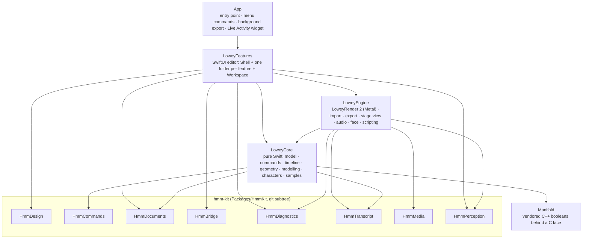
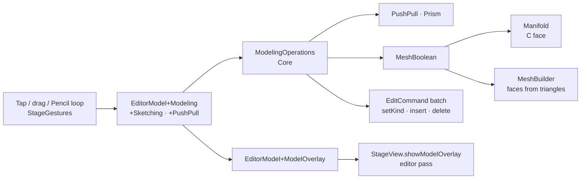
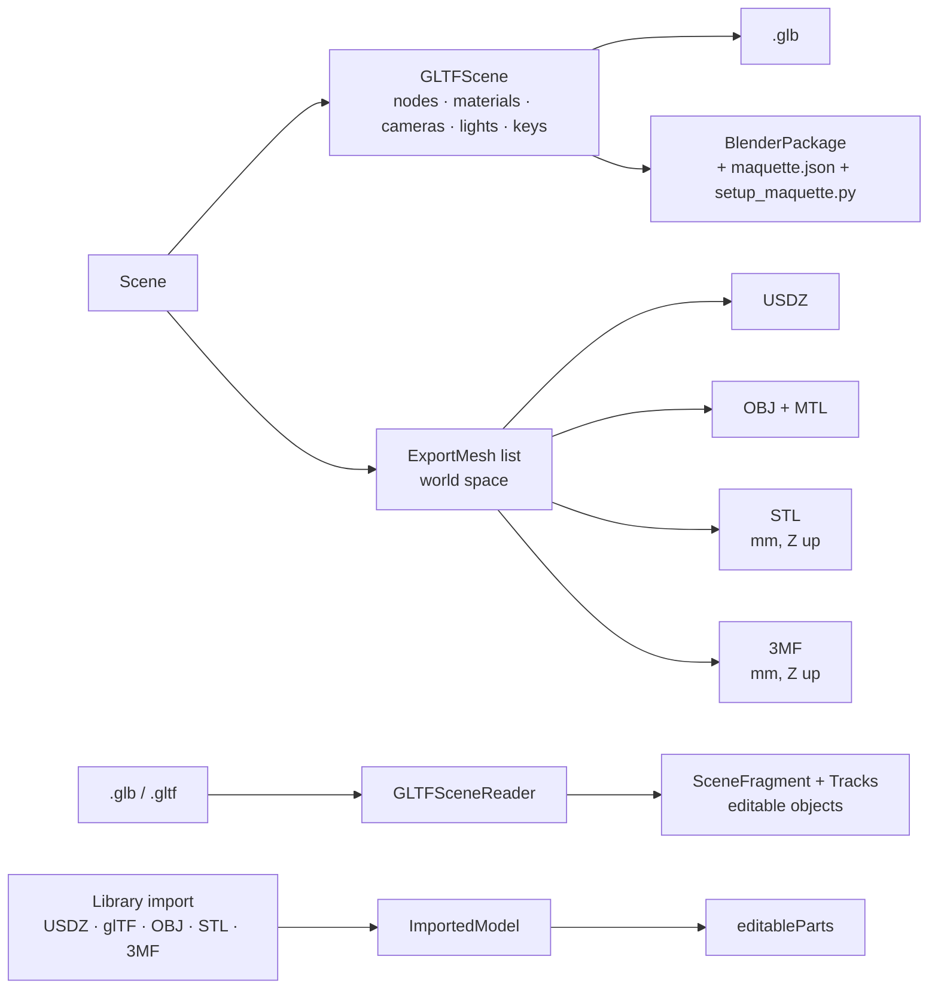
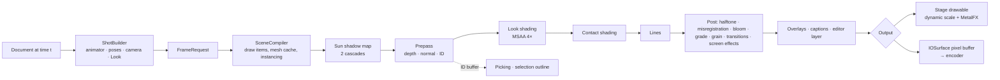
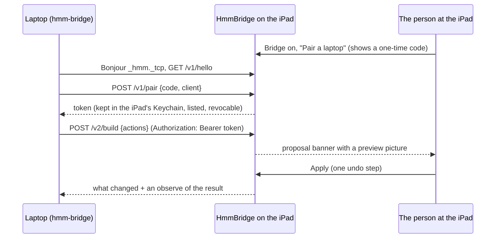

# Architecture

Manim-like at the core: **objects → properties → animation → timeline → scene**, saved as plain JSON. Every change
is a **command**. The UI, gestures, drawing, the library, scripts and the AI bridge all speak the same command
language, so there are no side doors and every change is one undo step.

## Modules



| Module | Imports | What it holds | Tests |
|---|---|---|---|
| **LoweyCore** | Foundation, hmm-kit's Commands / Documents / Transcript, Manifold | The document model, commands with exact inverses, the session (undo, coalescing), timeline and easing, animator and behaviours, geometry and meshers, modelling (editable meshes, sketches, push/pull, booleans), the glTF reader, rigs and retargeting, blob and puppet characters, Scene Script compiler, Looks as data, samples (Enigma, Welcome island, Night Market) | Linux (`swift:6.1`), coverage gate |
| **Manifold** (`Packages/Manifold`) | the C++ standard library | Manifold 3.5.4 (Apache-2.0) as a C++17 target, single-threaded, and `ManifoldBridge.h`: boolean and validate in plain C, so Swift needs no C++ interop. `VENDORED.md` says how to update it | Linux and the iPad simulator (its own tests; LoweyCore's boolean tests) |
| **LoweyEngine** | Core, Metal, AVFoundation, Vision, ARKit, JavaScriptCore, hmm-kit's Media / Diagnostics / Perception / Transcript | LoweyRender 2, the shot builder, the stage view (`StageView`), model loading and caching, export sessions and presets, overlays and captions, the Night Market benchmark, face capture, the JavaScript runner | iPad simulator: golden images, export, picking, skinning |
| **LoweyFeatures** | Core, Engine, SwiftUI, hmm-kit's Design / Bridge / Documents / Diagnostics | The editor. `Workspace/` is shared by every feature (app and editor models, the session API, controls); each other folder is one feature's views; `Shell/` composes them | iPad simulator: bridge security, editor flows |
| **App** | Features, ActivityKit, BackgroundTasks | `LoweyApp`, the export Live Activity, the widget extension | UI smoke tests |

**Rules** (enforced in CI): LoweyCore imports no Apple UI or 3D framework; features never reference each other's
types (`Tools/check-feature-boundaries.py`); no file over 500 lines, no function over 60, no type body over 350,
complexity ≤ 12, no force unwraps outside tests (SwiftLint `--strict`); Swift 6 language mode with warnings as errors.

## One edit, end to end

```mermaid
sequenceDiagram
    participant UI as Feature view / gesture
    participant EM as EditorModel (Workspace)
    participant Ops as Operations (Core)
    participant ES as EditSession (Core)
    participant SB as ShotBuilder (Engine)
    participant R as LoweyRender 2
    participant J as History journal
    UI->>EM: duplicateSelection()
    EM->>Ops: duplicate(ids, in: scene)
    Ops-->>EM: EditCommand
    EM->>ES: perform(command, coalesceKey)
    ES-->>EM: ChangeSet (inverse kept for undo)
    EM->>SB: document changed
    SB->>R: FrameRequest (evaluated scene, camera, Look, editor layer)
    R-->>UI: next frame on the stage
    EM->>J: the step's ops (journalChanged)
    J-->>J: one JSON line within 50 ms; a checkpoint every 200 changes / 5 s idle
```

Continuous gestures (drags, sliders, the joystick, Perform) pass a coalesce key, so a whole gesture is one undo step.
Scene Scripts and bridge proposals compile into one `batch` command. `J` is the scene's `HistoryJournal` (below).

## Modelling



- **`EditableMesh`** (Core `Modeling/`): vertices and faces (outline + holes) in the object's space, metres; the
  `mesh` object kind. `MeshTopology` builds half-edges per operation; `MeshBuilder` turns triangles (primitives,
  drawings, boolean results) into whole faces; `PolygonTriangulator` cuts faces with holes for the GPU and Manifold.
- **`MeshBoolean`** flattens both meshes into the C structs, calls `MBBoolean`, and rebuilds faces (D-115, D-117).
  `PushPull` slides a face when its neighbours stand square to it, else sweeps a `Prism` and combines it (D-119).
- **`Sketch`** (the `sketch` kind): a world plane, curves (line, rectangle, circle, arc, spline, polyline), the object
  it was drawn on; `regions` nest closed loops into areas with holes. `ModelingOperations` turns a pull, cut,
  boolean, push/pull or new curve into one labelled batch of existing commands (D-118).
- **On the stage** (Features `Workspace/Session`): `ModelingState` (mode, the picked elements or region, the shape
  being drawn, the live pull) is view state, never undone. Taps go `StageGestures` → `modelTap`; a drag on the picked
  face or region becomes `.pushPull`, a Pencil loop `.modelLasso`. While dragging, `kindOverride` shows a sliding face
  without touching the document (D-120). `EditorModel+ModelOverlay` builds the marks as `EditorOverlay`s with Core's
  `ModelOverlay` and the floating numbers (`DimensionLabel`, drawn by `Model/ModelDimensions` over the stage).

### Modelling II (0.4)

- **Shape operations** (Core `Modeling/`): `Inset` (topology only: a ring of quads, the face keeps its index),
  `EdgeBevel` (a chamfer or fillet profile swept along each edge, cut or filled with `MeshBoolean`), `Shell` (every
  face offset inward by `PlaneSolve`, the cavity cut out; open faces are push/pulled through the wall first),
  `MeshMirror` (reflection, symmetrize = keep a half-space side, mirror, union). `ModelingOperations+Shape` turns each
  into one labelled batch and re-symmetrizes objects with the `symmetry` property after every edit (D-127).
- **Exactness**: `MeshBoolean` snaps the corners Manifold creates onto the input planes they lie on (`PlaneSolve`), and
  `MeshBuilder.closeTJunctions` puts corners a neighbour kept into the other face's edge (D-126).
- **Precision**: `PointSnap` (corners, edge middles, edges, faces, grid, by screen distance) serves sketching,
  measuring and building (`EditorModel+Precision.snapPoint`). Kept measurements are `dimension` objects
  (`Dimension.swift`). The section plane (`SectionPlane`, `workspace.json`) reaches the renderer through
  `StageView.section` → `EditorScene.section` → `FrameUniforms.section` (D-131); `StageView.showPrecisionOverlay`
  draws the printer's volume and kept dimensions whatever the tool.
- **Printing**: `PrintCheck` (topology, Manifold, wall rays, the bed) and `repair`; `PrintBed` presets.
- **Building**: `Architecture` (walls from a centre line, opening blocks, slabs, stairs), driven by
  `EditorModel+Architecture`'s tap tools.
- **Features**: `EditorModel+ShapeOps` (bevel/round/inset/shell with the size that floats, mirror, symmetry, the print
  check, Make editable for placed models), `EditorModel+Measure`, `EditorModel+Architecture`, `EditorModel+Precision`;
  the views are `Model/ModelShapeControls` (the bar's pick actions, mirror and print controls) and `Model/PrecisionPage`.

## Interop



Everything is Core (pure Swift, Linux-tested) except reading USDZ (ModelIO) and placed models' loaded parts, which
Engine's `ModelExport` hands Core as `GLTFScene.LocalPart`s. 3MF reading uses Core's `Inflate` (D-137). CI checks the
M3 block's STL and 3MF with trimesh and renders a frame of a Blender package in Blender 4.2 and 5.2 (the `interop`
job, from files LoweyCore's tests write to `ACCEPTANCE_DIR`).

## LoweyRender 2



- **Looks are data.** `LookPreset` (Core) holds shading, lines, finish and stepping; `LookResolver` turns a Look, a
  mood and per-object overrides into GPU parameters.
- **One path for everything.** The stage, thumbnails, snapshots and export all build a `FrameRequest` with
  `ShotBuilder` and render it with the same renderer; the stage adds only the editor layer (grid, gizmo, guides,
  selection outline). A test renders the stage's frame and the export's frame and compares them.
- **Geometry** comes from Core (`MeshData`: primitives with bevels, drawings, text, characters) and from imported
  models (`ModelLibrary`: glTF through Core's reader, USDZ and OBJ through ModelIO), converted once to the
  renderer's vertex format and cached.
- **Front faces are counter-clockwise**, depth is reverse-Z, uniforms are triple-buffered.

## Documents

A project is a `.maquette` folder package (3D-lowey's `.lowey` ones open too): `project.json`, `scenes/*.json`,
`history/`, `assets/`, `audio/`, `renders/`, a thumbnail and its turntable, and `workspace.json` (how it shows:
Core's `ProjectWorkspace`, outside the journal). Every file is a versioned envelope
`{schemaVersion, kind, payload}`; older versions migrate on load (1.x projects included), newer ones are refused with a
clear message. Writes are atomic and keep a `.bak` of the last good version. The format is documented for readers in
[PROJECT_FORMAT.md](PROJECT_FORMAT.md).

**The history journal** (hmm-kit's `HistoryJournal`, Maquette's `ProjectHistory`): every scene has one in
`history/<scene-id>/`. `CommandStack` records each change as a `HistoryOp` (perform, undo, redo, gesture and group
boundaries); `EditorModel+History` hands them to the journal, which appends them as JSON lines on a serial queue.
Checkpoints (every 200 changes, 5 s idle, backgrounding, closing a scene) write a snapshot, store each undo step once
by reference, then write `project.json` and the scene file from the same state. Opening a scene is
`ProjectHistory.open`: the checkpoint, its newest 64 undo steps, and the tail replayed (older steps load as undo
reaches them). The history scrubber (`HistoryCursor` in Core, Actions ▸ History) walks the undo steps both ways from
wherever it is; versions live in `history/<scene-id>/versions/`. hmm-kit's `DocumentLocator` puts projects in iCloud Drive when the build has the
entitlement, on the device otherwise; `HmmConflictSheet` resolves conflicting versions.

## The layout

docs/LAYOUT.md is the map; the Shell composes it. `RootView` shows Home (`TheaterView`) and presents the open project
over it as a full-screen cover with the zoom transition from the card's picture. `EditorScreen` stacks the stage and
the timeline by `EditorModel.timelinePresence` (hidden, transport, full; height and presence come from and go back to
`workspace.json` through `EditorModel+Workspace`). `StageChrome` lays out the two clusters, the panel each opens, the
sidebar and the bottom row; `FloatingInspector` places `InspectorPanel` with hmm-kit's `HmmFloatingPlacement`
beside `EditorModel.selectionScreenRect` (the selection's box projected by the stage, refreshed on edits and after the
camera settles: `EditorModel+Inspector`). Panels resize with hmm-kit's `hmmResizable`.

Home's cards (`Workspace/UI`: `GalleryGrid`, `ProjectCard`, `StackCard`, `TurntableView`) are shared by Home and
the Home benchmark (Diagnostics), so the benchmark measures the real grid. The turntable is drawn after a project
closes (`AppModel.drawCard`, `Thumbnailer.turntable`) and read a frame at a time while a card is visible. Stacks,
search and sort are hmm-kit's `GalleryArrangement` (`gallery.json` in the projects folder; `AppModel+Gallery`).
Starter templates are Core's `StarterTemplate`: a Look and Mood to suggest, a starting viewpoint and a workspace.

## Device tiers and the load meter

`DeviceTier` (hmm-kit, from the GPU family and memory) picks a `PreviewQuality` for the stage: the render-scale range
`DynamicScale` moves in and the sun's shadow-map size; the frame budget comes from the screen's refresh. Exports,
stills and thumbnails always render `.full`. `PerformanceMonitor` feeds hmm-kit's `LoadMeter` with each frame's work
(GPU time, CPU encode time) and the scene's cost (`SceneCost`); the `LoadChip` appears only near the limit, with the
fixes that help.

## Export

`ExportSession` (Engine, main actor) renders frame by frame at full scale with no time budget, straight into the
encoder's pixel buffers, then verifies the file with HmmMedia's inspector (frames, size, duration, audio, alpha)
before returning it. 3D files come from `ModelExport.files` (glTF, USDZ, OBJ + MTL, STL, 3MF, the Blender package). In the background the app keeps exporting under a `BGContinuedProcessingTask`; progress reaches
the Live Activity through `ExportProgressReporting`, and a notification says when it's done.

## The bridge



MCP v2 is sixteen tools on the laptop over a handful of `/v2` routes: `status`, `project`, `transcript`, `actions`,
`assets` (+ `thumbnail`), `build`, `observe`, `contact_sheet`, `commit`, `media`. Every scene change is a Scene Script
v3 batch compiled by LoweyCore's `ScriptCompiler` (the relation solver, the camera solver, lighting recipes, intents)
into one `EditCommand`. The v1 routes stay for 1.x laptops.

## Perception

`ShotObserver` (LoweyCore, pure Swift) measures a shot: it evaluates the scene at a time, projects every labelled
object through the shot camera into a small depth-tested CPU raster (coverage, visibility, frame cuts), checks
grounding and intersections against the Kit's metadata, reads the frame (thirds, headroom, tangents, clutter) and,
given the rendered pixels, contrast, silhouette, palette and light; `ShotRubric` grades it. `ExportSession.observe`
(Engine) renders the frame like the export, hands the drawn meshes and pixels to the observer and draws the views
(set-of-marks, orthographic diagrams with the camera's wedge, value, silhouette from the ID buffer).

Unpaired requests get 401, requests from outside the local network 403, a pairing attempt while no code is showing
409. The bridge is off by default and switched off entirely in the App Store configuration.

## CI and release

A `changes` job routes each PR by what it touches (docs → nothing, Core → Linux, Engine → render tests, Features/App
→ feature tests, app build and UI tests); every merge to main runs everything. `CI result` is the one required check.

```mermaid
flowchart LR
    Push[PR / main] --> Lint[SwiftLint --strict<br/>SwiftFormat]
    Push --> CoreT[LoweyCore tests<br/>Linux + coverage]
    Push --> Tools[Laptop tools<br/>pytest + generated files]
    Push --> EngineT[LoweyEngine<br/>simulator render tests]
    Push --> FeatT[LoweyFeatures<br/>boundaries + tests]
    Lint --> AppT[App build + UI smoke tests]
    CoreT & Tools & EngineT & FeatT & AppT --> Green
    AppT --> Shots[App Store screenshots<br/>iPad 13" + iPhone 6.9"]
    Green{CI result}
    Green -->|main| IPA[Release: Maquette.ipa artifact]
    Tag[tag v*] --> Gate{commit passed CI?}
    Gate -->|yes| Rel[GitHub Release + .ipa]
    Gate -->|yes, ASC secrets set| TF[TestFlight: App Store build]
```

The tools job also checks that `AppUITests/LayoutWalk.swift` is what `Tools/layout_walk.py` makes of docs/LAYOUT.md;
the UI tests walk every row (five tests, by precondition, Model on its own), measure the idle stage's share of the screen and run the Home benchmark.

Golden images are recorded on the CI simulator (`TEST_RUNNER_GOLDEN_OUTPUT`), reviewed and committed under
`Packages/LoweyEngine/Tests/LoweyEngineTests/Golden`.
