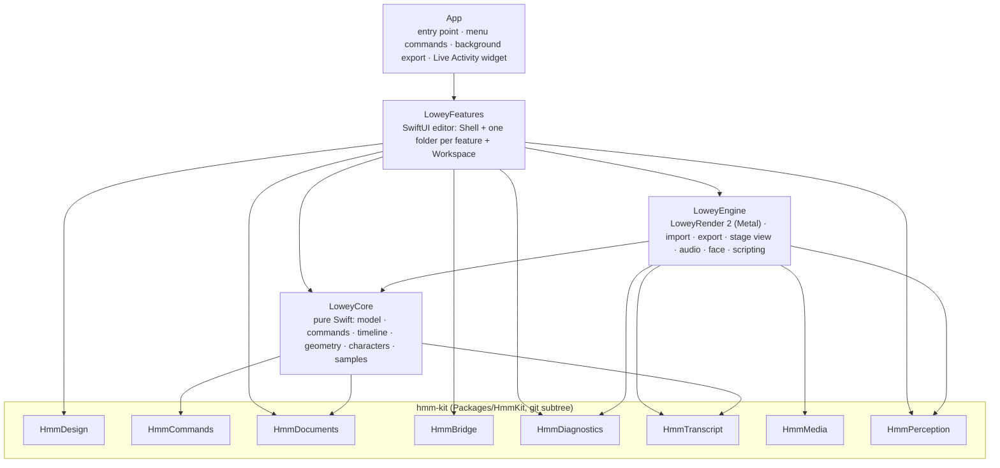
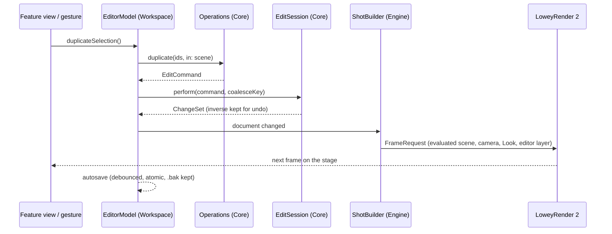
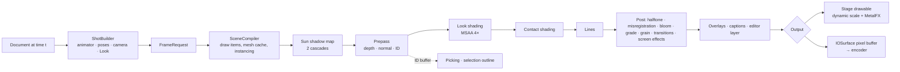
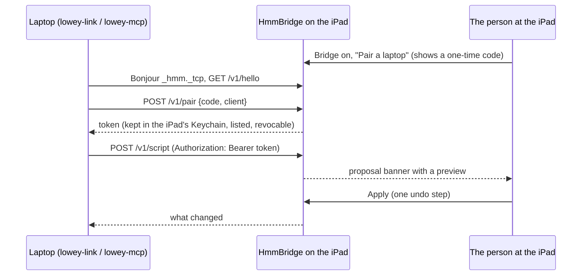
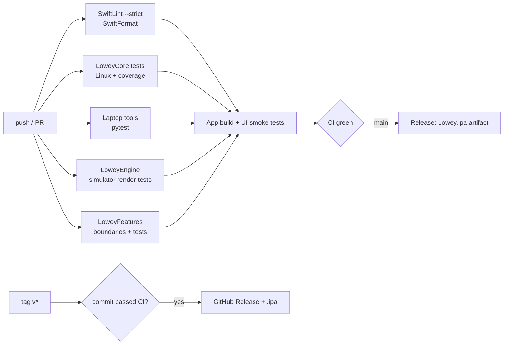

# Architecture

Manim-like at the core: **objects → properties → animation → timeline → scene**, saved as plain JSON. Every change
is a **command**. The UI, gestures, drawing, the library, scripts and the AI bridge all speak the same command
language, so there are no side doors and every change is one undo step.

## Modules

| Module | Imports | What it holds | Tests |
|---|---|---|---|
| **LoweyCore** | Foundation, hmm-kit's Commands / Documents / Transcript | The document model, commands with exact inverses, the session (undo, coalescing), timeline and easing, animator and behaviours, geometry and meshers, the glTF reader, rigs and retargeting, blob and puppet characters, Scene Script compiler, Looks as data, samples (Enigma, Welcome island, Night Market) | Linux (`swift:6.1`), coverage gate |
| **LoweyEngine** | Core, Metal, AVFoundation, Vision, ARKit, JavaScriptCore, hmm-kit's Media / Diagnostics / Perception / Transcript | LoweyRender 2, the shot builder, the stage view (`StageView`), model loading and caching, export sessions and presets, overlays and captions, the Night Market benchmark, face capture, the JavaScript runner | iPad simulator: golden images, export, picking, skinning |
| **LoweyFeatures** | Core, Engine, SwiftUI, hmm-kit's Design / Bridge / Documents / Diagnostics | The editor. `Workspace/` is shared by every feature (app and editor models, the session API, controls); each other folder is one feature's views; `Shell/` composes them | iPad simulator: bridge security, editor flows |
| **App** | Features, ActivityKit, BackgroundTasks | `LoweyApp`, the export Live Activity, the widget extension | UI smoke tests |

**Rules** (enforced in CI): LoweyCore imports no Apple UI or 3D framework; features never reference each other's
types (`Tools/check-feature-boundaries.py`); no file over 500 lines, no function over 60, no type body over 350,
complexity ≤ 12, no force unwraps outside tests (SwiftLint `--strict`); Swift 6 language mode with warnings as errors.

## One edit, end to end

Continuous gestures (drags, sliders, the joystick, Perform) pass a coalesce key, so a whole gesture is one undo step.
Scene Scripts and bridge proposals compile into one `batch` command.

## LoweyRender 2

- **Looks are data.** `LookPreset` (Core) holds shading, lines, finish and stepping; `LookResolver` turns a Look, a
  mood and per-object overrides into GPU parameters.
- **One path for everything.** The stage, thumbnails, snapshots and export all build a `FrameRequest` with
  `ShotBuilder` and render it with the same renderer; the stage adds only the editor layer (grid, gizmo, guides,
  selection outline). A test renders the stage's frame and the export's frame and compares them.
- **Geometry** comes from Core (`MeshData`: primitives with bevels, drawings, text, characters) and from imported
  models (`ModelLibrary`: glTF through Core's reader, USDZ and OBJ through ModelIO), converted once to the
  renderer's vertex format and cached.
- **Front faces are counter-clockwise**, depth is reverse-Z, uniforms are triple-buffered.

## Documents

A project is a `.lowey` folder package: `project.json`, `scenes/*.json`, `assets/`, `audio/`, `renders/`, a
thumbnail and a looping preview. Every file is a versioned envelope `{schemaVersion, kind, payload}`; older versions
migrate on load (1.x projects included), newer ones are refused with a clear message. Writes are atomic and keep a
`.bak` of the last good version. hmm-kit's `DocumentLocator` puts projects in iCloud Drive when the build has the
entitlement, on the device otherwise; `HmmConflictSheet` resolves conflicting versions.

## Export

`ExportSession` (Engine, main actor) renders frame by frame at full scale with no time budget, straight into the
encoder's pixel buffers, then verifies the file with HmmMedia's inspector (frames, size, duration, audio, alpha)
before returning it. In the background the app keeps exporting under a `BGContinuedProcessingTask`; progress reaches
the Live Activity through `ExportProgressReporting`, and a notification says when it's done.

## The bridge

Unpaired requests get 401, requests from outside the local network 403, a pairing attempt while no code is showing
409. The bridge is off by default and switched off entirely in the App Store configuration.

## CI and release

Golden images are recorded on the CI simulator (`TEST_RUNNER_GOLDEN_OUTPUT`), reviewed and committed under
`Packages/LoweyEngine/Tests/LoweyEngineTests/Golden`.
